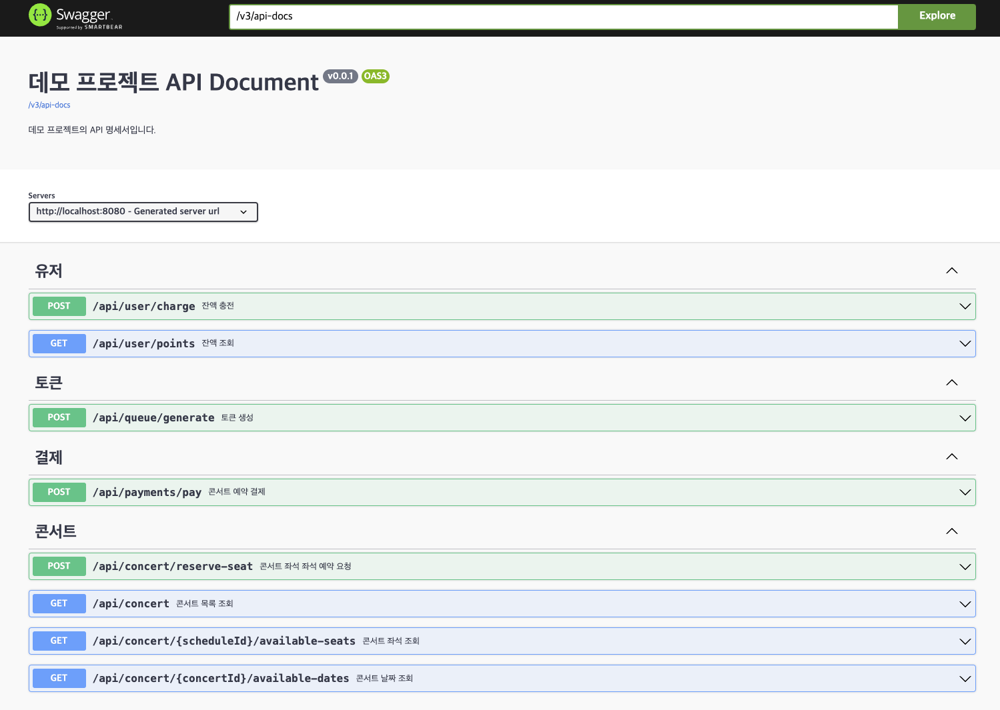

# 예약 서비스

## Swagger

<details>
    <summary></summary>



</details>

## 프로젝트 MileStone, API명세서

[구글 Docs 문서](https://docs.google.com/spreadsheets/d/1S2TsgAATEp7fZUqq_fYa20B5rVjvJuVm4wjqANgiSU4/edit?usp=sharing)


## 시퀀스 다이어그램

<details>
    <summary></summary>


</details>

## ERD

<details>
    <summary></summary>


</details>


## MOCK Test Code

<details>
    <summary></summary>

[Mock TEST CODE](https://github.com/Ssantoo/booking_service/pull/1)
</details>

-> restdocs-api 작성 시도 중

## API Specs

<details>
    <summary></summary>

1️⃣ **`주요` 유저 대기열 토큰 기능    post**

- 서비스를 이용할 토큰을 발급받는 API를 작성합니다.
- 토큰은 유저의 UUID 와 해당 유저의 대기열을 관리할 수 있는 정보 ( 대기 순서 or 잔여 시간 등 ) 를 포함합니다.
- 이후 모든 API 는 위 토큰을 이용해 대기열 검증을 통과해야 이용 가능합니다.

> 기본적으로 폴링으로 본인의 대기열을 확인한다고 가정하며, 다른 방안 또한 고려해보고 구현해 볼 수 있습니다.
> 

2️⃣ `기본` 예약 가능 날짜 / 좌석 API  get**

- 예약가능한 날짜와 해당 날짜의 좌석을 조회하는 API 를 각각 작성합니다.
- 예약 가능한 날짜 목록을 조회할 수 있습니다.

- 날짜 정보를 입력받아 예약가능한 좌석정보를 조회할 수 있습니다.

> 좌석 정보는 1 ~ 50 까지의 좌석번호로 관리됩니다.
> 

3️⃣ **`주요` 좌석 예약 요청 API   post**

- 날짜와 좌석 정보를 입력받아 좌석을 예약 처리하는 API 를 작성합니다.
- 좌석 예약과 동시에 해당 좌석은 그 유저에게 약 5분간 임시 배정됩니다. ( 시간은 정책에 따라 자율적으로 정의합니다. )
- 만약 배정 시간 내에 결제가 완료되지 않는다면 좌석에 대한 임시 배정은 해제되어야 하며 다른 사용자는 예약할 수 없어야 한다.

4️⃣ **`기본`**  **잔액 충전 / 조회 API   post / get**

- 결제에 사용될 금액을 API 를 통해 충전하는 API 를 작성합니다.
- 사용자 식별자 및 충전할 금액을 받아 잔액을 충전합니다.
- 사용자 식별자를 통해 해당 사용자의 잔액을 조회합니다.

5️⃣ **`주요` 결제 API   post**

- 결제 처리하고 결제 내역을 생성하는 API 를 작성합니다.
- 결제가 완료되면 해당 좌석의 소유권을 유저에게 배정하고 대기열 토큰을 만료시킵니다.

#### 고민중
- 유저는 한명당 하나의 좌석만 예약할 수 있다.
- 좌석별로 가격이 다르다
- 포인트 충전 좌석가격에 비해 부족하면 충전
- 콘서트 예약 날짜 당일 취소시 취소 수수료 발생
- 좌석 상태 변경 ( 빈자리, 예약중, 결제중?, 예약됨)
- 좌석 토큰에 날짜 등 , 정보포함
- 해당 날짜부터 콘서트 시작날짜까지 선택가능
- 콘서트예약 오픈날짜
- 콘서트날짜
  
</details>


## Lock Study

### Lock ###

*정의*

- 데이터베이스에서 동시성을 관리하고 데이터 무결성을 유지 하기 위해 사용


*유형*
- s-lock ( 공유락 )
```
    공유락은 여러 트랜잭션이 동시에 리소스를 읽을 수 있게 하되, 
    그 리소스를 수정할 수 없도록 한다
    즉, 읽게는 해주지만 쓰지는 마~
```
- x-lock ( 배타락 )
```
   배타락은 특정 리소스를 수정해야 할 때 사용
   트랜잭션이 리소스를 독점적으로 접근할 수 있으며, 
   다른 트랜잭션이 해당 리소스를 읽거나 쓸 수 없도록 한다
   즉, 읽지도 쓰지도 아무것도 하지말고 기다려~
```
    
그렇다면 우리가 사용할 LockModeType 에는

            LockModeType

    - Pessimistic_read (s-lock)
    - Pessimistic_write (x-lock)

*문제*

예약시스템을 한다고 했을 때

                tx 1 { PESSIMISTIC_READ        update }
                tx 2  { PESSIMISTIC_READ        update }

시도한다면 결과는?
<details>
    <summary></summary>

둘다 실패

```
        tx 1 { PESSIMISTIC_READ        update }
                                    (tx2 가 s-lock 소지중이야 너 기다려)
        tx 2  { PESSIMISTIC_READ        update }
                                         (tx1 이 s-lock 소지중이야 너 기다려)
                                         = 데드락
```

</details>

그렇다면 두개의 충전 과 1개의 조회가 있다면?

```
    tx 1 { PESSIMISTIC_WRITE        update }
    tx 2  { PESSIMISTIC_WRITE        update }
    tx 3   { READ }
```
시도한다면 결과는?
<details>
    <summary></summary>

tx3은 
tx1, tx2가 끝날때까지 기다리게 된다
```
tx 1 { PESSIMISTIC_WRITE        update }
tx 2  {                                 PESSIMISTIC_WRITE        update }
tx 3   {                                                                  READ }

```

.png)

</details>

> 프로젝트에서 사용할만 로직
> > 포인트 충전
> 
> > 포인트 사용
> 
> > 좌석 예약

<details>
    <summary>포인트 충전</summary>

.png)

.png)


> 낙관적 락은 데이터 충돌이 드물고, 트랜잭션이 자주 충돌하지 않는 상황에서 효율적이다
그러나 포인트 충전과 같은 동시성 문제가 발생하기 쉬운 작업에서는 낙관적 락이 자주 충돌을 일으켜 ObjectOptimisticLockingFailureException이 발생
하므로 *비추*

> 비관적 락은 충돌을 예방하기 위해 트랜잭션이 자원에 접근할 때 락을 걸어 다른 트랜잭션이 접근하지 못하게 한다.
데이터의 일관성을 보장하지만, 트랜잭션 간의 대기 시간이 발생하고, 특히 고성능이 요구되는 환경에서는 성능 병목 및
비관적 락의 DB 커넥션 점유 문제가 발생하므로 *비추*

</details>
