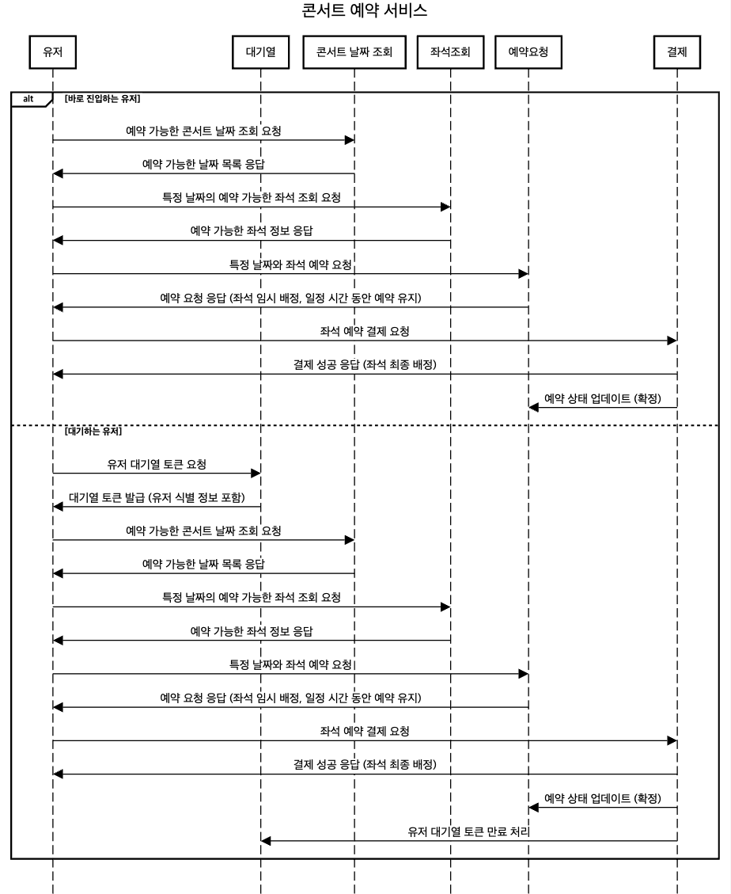
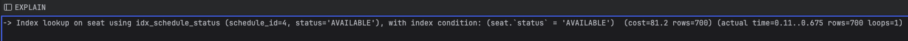

# 예약 서비스

## Swagger

<details>
    <summary></summary>


</details>

## 프로젝트 MileStone, API명세서

[구글 Docs 문서](https://docs.google.com/spreadsheets/d/1S2TsgAATEp7fZUqq_fYa20B5rVjvJuVm4wjqANgiSU4/edit?usp=sharing)


## 시퀀스 다이어그램

<details>
    <summary></summary>



</details>

## ERD

<details>
    <summary></summary>


</details>


## MOCK Test Code

<details>
    <summary></summary>

[Mock TEST CODE](https://github.com/Ssantoo/booking_service/pull/1)
</details>

-> restdocs-api 작성 시도 중

## API Specs

<details>
    <summary></summary>

1️⃣ **`주요` 유저 대기열 토큰 기능    post**

- 서비스를 이용할 토큰을 발급받는 API를 작성합니다.
- 토큰은 유저의 UUID 와 해당 유저의 대기열을 관리할 수 있는 정보 ( 대기 순서 or 잔여 시간 등 ) 를 포함합니다.
- 이후 모든 API 는 위 토큰을 이용해 대기열 검증을 통과해야 이용 가능합니다.

> 기본적으로 폴링으로 본인의 대기열을 확인한다고 가정하며, 다른 방안 또한 고려해보고 구현해 볼 수 있습니다.
> 

2️⃣ `기본` 예약 가능 날짜 / 좌석 API  get**

- 예약가능한 날짜와 해당 날짜의 좌석을 조회하는 API 를 각각 작성합니다.
- 예약 가능한 날짜 목록을 조회할 수 있습니다.

- 날짜 정보를 입력받아 예약가능한 좌석정보를 조회할 수 있습니다.

> 좌석 정보는 1 ~ 50 까지의 좌석번호로 관리됩니다.
> 

3️⃣ **`주요` 좌석 예약 요청 API   post**

- 날짜와 좌석 정보를 입력받아 좌석을 예약 처리하는 API 를 작성합니다.
- 좌석 예약과 동시에 해당 좌석은 그 유저에게 약 5분간 임시 배정됩니다. ( 시간은 정책에 따라 자율적으로 정의합니다. )
- 만약 배정 시간 내에 결제가 완료되지 않는다면 좌석에 대한 임시 배정은 해제되어야 하며 다른 사용자는 예약할 수 없어야 한다.

4️⃣ **`기본`**  **잔액 충전 / 조회 API   post / get**

- 결제에 사용될 금액을 API 를 통해 충전하는 API 를 작성합니다.
- 사용자 식별자 및 충전할 금액을 받아 잔액을 충전합니다.
- 사용자 식별자를 통해 해당 사용자의 잔액을 조회합니다.

5️⃣ **`주요` 결제 API   post**

- 결제 처리하고 결제 내역을 생성하는 API 를 작성합니다.
- 결제가 완료되면 해당 좌석의 소유권을 유저에게 배정하고 대기열 토큰을 만료시킵니다.

#### 고민중
- 유저는 한명당 하나의 좌석만 예약할 수 있다.
- 좌석별로 가격이 다르다
- 포인트 충전 좌석가격에 비해 부족하면 충전
- 콘서트 예약 날짜 당일 취소시 취소 수수료 발생
- 좌석 상태 변경 ( 빈자리, 예약중, 결제중?, 예약됨)
- 좌석 토큰에 날짜 등 , 정보포함
- 해당 날짜부터 콘서트 시작날짜까지 선택가능
- 콘서트예약 오픈날짜
- 콘서트날짜
  
</details>


## Lock

*정의*

- 데이터베이스에서 동시성을 관리하고 데이터 무결성을 유지 하기 위해 사용


*유형*
- s-lock ( 공유락 )
```
    공유락은 여러 트랜잭션이 동시에 리소스를 읽을 수 있게 하되, 
    그 리소스를 수정할 수 없도록 한다
    즉, 읽게는 해주지만 쓰지는 마~
```
- x-lock ( 배타락 )
```
   배타락은 특정 리소스를 수정해야 할 때 사용
   트랜잭션이 리소스를 독점적으로 접근할 수 있으며, 
   다른 트랜잭션이 해당 리소스를 읽거나 쓸 수 없도록 한다
   즉, 읽지도 쓰지도 아무것도 하지말고 기다려~
```
    
그렇다면 우리가 사용할 LockModeType 에는

            LockModeType

    - Pessimistic_read (s-lock)
    - Pessimistic_write (x-lock)

*문제*

예약시스템을 한다고 했을 때

                tx 1 { PESSIMISTIC_READ        update }
                tx 2  { PESSIMISTIC_READ        update }

시도한다면 결과는?
<details>
    <summary></summary>

둘다 실패

```
        tx 1 { PESSIMISTIC_READ        update }
                                    (tx2 가 s-lock 소지중이야 너 기다려)
        tx 2  { PESSIMISTIC_READ        update }
                                         (tx1 이 s-lock 소지중이야 너 기다려)
                                         = 데드락
```

</details>

그렇다면 두개의 충전 과 1개의 조회가 있다면?

```
    tx 1 { PESSIMISTIC_WRITE        update }
    tx 2  { PESSIMISTIC_WRITE        update }
    tx 3   { READ }
```
시도한다면 결과는?
<details>
    <summary></summary>

tx3은 
tx1, tx2가 끝날때까지 기다리게 된다
```
tx 1 { PESSIMISTIC_WRITE        update }
tx 2  {                                 PESSIMISTIC_WRITE        update }
tx 3   {                                                                  READ }

```

.png)

</details>

> 프로젝트에서 사용할만 로직
> > <a href="#locking-details-charge"> 포인트 충전 </a>
> 
> > <a href="#locking-details-use"> 포인트 사용 </a>
> 
> >  <a href="#locking-details"> 좌석 예약 </a>

<details id="locking-details-charge">
    <summary>포인트 충전 및 사용</summary>

.png)

.png)


> 낙관적 락은 데이터 충돌이 드물고, 트랜잭션이 자주 충돌하지 않는 상황에서 효율적이다
그러나 포인트 충전과 같은 동시성 문제가 발생하기 쉬운 작업에서는 낙관적 락이 자주 충돌을 일으켜 ObjectOptimisticLockingFailureException이 발생
하므로 *비추*

> 비관적 락은 충돌을 예방하기 위해 트랜잭션이 자원에 접근할 때 락을 걸어 다른 트랜잭션이 접근하지 못하게 한다.
데이터의 일관성을 보장하지만, 트랜잭션 간의 대기 시간이 발생하고, 특히 고성능이 요구되는 환경에서는 성능 병목 및
비관적 락의 DB 커넥션 점유 문제가 발생하므로 *비추*

</details>

<details id="#locking-details-use">
    <summary>포인트 충전 및 사용</summary>

.png)


> 낙관적 락은 데이터 충돌이 드물고, 트랜잭션이 자주 충돌하지 않는 상황에서 효율적이다
그러나 포인트 충전과 같은 동시성 문제가 발생하기 쉬운 작업에서는 낙관적 락이 자주 충돌을 일으켜 ObjectOptimisticLockingFailureException이 발생
하므로 *비추*

> 비관적 락은 충돌을 예방하기 위해 트랜잭션이 자원에 접근할 때 락을 걸어 다른 트랜잭션이 접근하지 못하게 한다.
데이터의 일관성을 보장하지만, 트랜잭션 간의 대기 시간이 발생하고, 특히 고성능이 요구되는 환경에서는 성능 병목 및
비관적 락의 DB 커넥션 점유 문제가 발생하므로 *비추*

</details>


<details id="locking-details">
    <summary>좌석 예약</summary>
비관적락


낙관적락


> 낙관적 락은 데이터 충돌이 드물고, 트랜잭션이 자주 충돌하지 않는 상황에서 효율적이다
그러나 포인트 충전과 같은 동시성 문제가 발생하기 쉬운 작업에서는 낙관적 락이 자주 충돌을 일으켜 ObjectOptimisticLockingFailureException이 발생
하므로 *비추*

> 비관적 락은 충돌을 예방하기 위해 트랜잭션이 자원에 접근할 때 락을 걸어 다른 트랜잭션이 접근하지 못하게 한다.
데이터의 일관성을 보장하지만, 트랜잭션 간의 대기 시간이 발생하고, 특히 고성능이 요구되는 환경에서는 성능 병목 및
비관적 락의 DB 커넥션 점유 문제가 발생하므로 *비추*

</details>

## Cache

    RedisTemplate과 RedisCacheManager 두 가지 설정이 있는데
    - RedisTemplate : Spring에서 Redis 서버와 상호 작용하기 위해 사용하는 직접적인 접근하는 방법
    - RedisCacheManager : Spring의 캐시 추상화를 사용하여 캐시를 관리하는 방법 ( Spring의 캐시 어노테이션 (@Cacheable, @CachePut, @CacheEvict)과 함께 사용, 캐시의 설정, 만료 시간, 직렬화 방식 등을 관리 )


### RedisTemplate

<details id="locking-details">
    <summary>RedisConfig</summary>

     @Configuration
    public class RedisConfig {

        @Value("${spring.data.redis.host}")
        private String redisHost;
    
        @Value("${spring.data.redis.port}")
        private int redisPort;

        @Bean
        public LettuceConnectionFactory redisConnectionFactory() {
            RedisStandaloneConfiguration redisStandaloneConfiguration = new RedisStandaloneConfiguration();
            redisStandaloneConfiguration.setHostName(redisHost);
            redisStandaloneConfiguration.setPort(redisPort);
            redisStandaloneConfiguration.setPassword(redisPassword);
            return new LettuceConnectionFactory(redisStandaloneConfiguration);
        }

        @Bean
        public RedisTemplate<String, Object> redisTemplate() {
            RedisTemplate<String, Object> redisTemplate = new RedisTemplate<>();
            redisTemplate.setConnectionFactory(redisConnectionFactory());
            redisTemplate.setKeySerializer(new StringRedisSerializer());
            redisTemplate.setValueSerializer(new StringRedisSerializer());
            return redisTemplate;
        }

        @Bean
        public RedisTemplate<String, byte[]> byteRedisTemplate() {
            RedisTemplate<String, byte[]> redisTemplate = new RedisTemplate<>();
            redisTemplate.setConnectionFactory(redisConnectionFactory());
            redisTemplate.setKeySerializer(new StringRedisSerializer());
            return redisTemplate;
        }

        @Bean
        public RedisTemplate<String, Long> longRedisTemplate() {
            RedisTemplate<String, Long> redisTemplate = new RedisTemplate<>();
            redisTemplate.setConnectionFactory(redisConnectionFactory());
            redisTemplate.setKeySerializer(new StringRedisSerializer());
            redisTemplate.setValueSerializer(new GenericToStringSerializer<>(Long.class));
            return redisTemplate;
        }

    }


    //service
    private final RedisTemplate<String, Long> redisTemplate;

    Long cached = redisTemplate.opsForValue().get("Key");
    

</details>
   

### CacheManager 

<details id="locking-details">
    <summary>RedisConfig</summary>

     @Configuration
    public class RedisConfig {
    
        @Value("${spring.data.redis.host}")
        private String redisHost;
    
        @Value("${spring.data.redis.port}")
        private int redisPort;
    
        @Bean
        public RedisConnectionFactory redisConnectionFactory() {
            return new LettuceConnectionFactory(new RedisStandaloneConfiguration(redisHost, redisPort));
        }
    
        @Bean
        public RedisTemplate<String, Object> redisTemplate(ObjectMapper objectMapper) {
            RedisTemplate<String, Object> redisTemplate = new RedisTemplate<>();
            redisTemplate.setConnectionFactory(redisConnectionFactory());
    
            redisTemplate.setKeySerializer(new StringRedisSerializer());
            redisTemplate.setValueSerializer(new GenericJackson2JsonRedisSerializer(objectMapper));
            redisTemplate.setHashKeySerializer(new StringRedisSerializer());
            redisTemplate.setHashValueSerializer(new GenericJackson2JsonRedisSerializer(objectMapper));
    
            return redisTemplate;
        }
    
        @Bean
        public CacheManager redisCacheManager(RedisConnectionFactory redisConnectionFactory) {
            return RedisCacheManager.RedisCacheManagerBuilder
                    .fromConnectionFactory(redisConnectionFactory)
                    .cacheDefaults(defaultConfiguration())
                    .withInitialCacheConfigurations(configureMap())
                    .build();
        }
    
        @Bean
        public ObjectMapper objectMapper() {
            ObjectMapper objectMapper = new ObjectMapper();
            objectMapper.registerModule(new JavaTimeModule());
            objectMapper.findAndRegisterModules();
            return objectMapper;
        }
    
        private Map<String, RedisCacheConfiguration> configureMap() {
            Map<String, RedisCacheConfiguration> cacheConfigurationMap = new HashMap<>();
            cacheConfigurationMap.put("getRedisWithCacheManager", defaultConfiguration().entryTtl(Duration.ofMinutes(5)));
            return cacheConfigurationMap;
        }
    
        private RedisCacheConfiguration defaultConfiguration() {
            return RedisCacheConfiguration.defaultCacheConfig()
                    .serializeKeysWith(RedisSerializationContext.SerializationPair.fromSerializer(new StringRedisSerializer()))
                    .serializeValuesWith(RedisSerializationContext.SerializationPair.fromSerializer(new GenericJackson2JsonRedisSerializer(objectMapper())))
                    .entryTtl(Duration.ofMinutes(10));
        }
    
    }


    //service
    @Cacheable(value = "concerts", key = "'concertList'", cacheManager = "redisCacheManager")
    public List<Concert> getConcertList() {
    

</details>

>자주 호출하는 데이터는 "실시간성" 에 문제가 생길 수 있다<br>
예를 들어 <br>
누군가 예약 -> 캐시 깨주고<br>
누군가 예약이 만료 -> 캐시 깨주고<br>
누군가 예약/결제 취소 -> 캐시 깨주고<br>
코드가 복잡해지고 관리하기 어려워지게된다<br>
진짜 단순하게 자주 바뀌지 않는 "콘서트 정보 조회", "콘서트 날짜 조회" 를 Cache로 남겨 호출하도록 로직을 변경하였다.

<details id="cache">
    <summary>콘서트 목록 조회</summary>

H2

.png)

Redis

.png)

</details>

<details id="cache">
    <summary>콘서트 날짜 조회</summary>

H2

.png)

Redis

.png)

</details>


## Index

*정의*

> 추가적인 쓰기 작업과 저장 공간을 활용하여 데이터베이스 테이블의 검색 속도를 향상시키기 위한 자료구조<br>
하지만 인덱스는 조회 성능을 높일 수 있지만 아래 사항들을 고려하여 설계해야한다<br>
    1. 한번에 찾을 수 있는 값 - 데이터 중복이 적은 컬럼<br>
    2. 인덱스 재정렬 최소화 - 데이터 삽입, 수정이 적은 컬럼<br>
    3. 인덱스의 목적은 검색 - 조회에 자주 사용되는 컬럼<br>
    4. 너무 많지 않은 인덱스 ( 약 3~4개 ) - 인덱스 또한 공간을 차지함<br>

*카디널리티*

> cardinality refers to the uniqueness of data values contained in a particular column (attribute) of a database table. The lower the cardinality, the more duplicated elements in a column. Thus, a column with the lowest possible cardinality would have the same value for every row. SQL databases use cardinality to help determine the optimal query plan for a given query.<br>
즉, 데이터의 중복 수치<br>
중복도가 ‘낮으면’ 카디널리티가 ‘높다’고 표현한다.<br>
중복도가 ‘높으면’ 카디널리티가 ‘낮다’고 표현한다.<br>

[출처](https://en.wikipedia.org/wiki/Cardinality_(SQL_statements))

그래서!! Index를 어떻게 하면 잘 사용하는건데?

>카디널리티가 높은 것
>* 기본적인 데이터의 성격
>    * 데이터 중복이 적어 한번에 찾을 수 있는 값
>    * 삽입, 수정이 적은 컬럼
>    * 조회에 자주 사용되는 컬럼
>* 데이터의 생명주기, 데이터 분포도
>    * 데이터의 값에 생명주기가 있는 경우, live한 데이터 값들을 유의미하게 만들 수 있음 (e.g. 주문 상태값)
>    * 데이터가 어떤 성향으로 분포되어 있는지 확인, 두 가지의 상태값이어도 99:1의 분포도라면 1을 찾기 위해 비용 소모가 클 수 있음 (e.g. 좌석 예매 상태)
>* 데이터 중복 사용 관점
>    * 인덱스도 하나의 테이블로 저장, 관리되기 때문에 하나의 인덱스로 처리가 가능한 경우는 하나로 처리될 수 있도록
>* 복합 인덱스인 경우 우선정렬을 따르기 때문에, 첫 번째 컬럼이 무엇이 되는지도 중요

그렇다면 위에처럼 잘 쓰려면 유의사항 또한 중요!!

>* 인덱스 컬럼의 값과 타입을 그대로 사용할 것 ( 인덱스는 컬럼의 값만 알고 있음 )
>* LIKE, BETWEEN, <, > 등 범위 조건의 컬럼은 Index 가 적용되나 그 뒤 컬럼은 Index 적용 x
	범위 조건의 경우, Index 사용에 유의할 것
>* AND 는 ROW 를 줄이지만 OR 는 비교를 위해 ROW 를 늘리므로 Full-Scan 발생확률이 높음
>* =, IN 은 다음 컬럼도 인덱스를 사용


*나의서비스*


<details id="index">
    <summary>좌석조회</summary>
    
```
@Override<br>
public List<Seat> findAvailableSeatsByScheduleId(long scheduleId, SeatStatus status) {<br>
        return seatJpaRepository.findByScheduleIdAndStatus(scheduleId, status).stream().map(SeatEntity::toModel).collect(Collectors.toList());<br>
}
```
    
카디널리티를 생각하여 카디널리티가 낮은 상태를 뒤에 넣는 방법으로 <br>
scheduleId 컬럼을 먼저 식별하여 필터를 한번 하고 
Status 컬럼에 좌석 예약 상태에 따른 조회가 많으며, <br> 예약 가능하거나 예약된 좌석의 상태를 조회하는데 있어
복합 인텍스를 걸어 주었다 <br>
>Status가 수정이 일어나지만 좌석조회 호출이 많을거 같아 사용


<details id="exam">
    <summary>비교</summary>

>데이터
>concert - 1 row
>schedule - 4 row
>seat - 4000 row (각 scheduleId 당 1000 row씩) / 좌석 상태는 AVAILABLE : RESERVED : HOLD = 7 : 2 : 1

```
EXPLAIN ANALYZE
    SELECT *
    FROM seat
    WHERE schedule_id = 4 AND status = 'AVAILABLE';
```





인덱스 적용 전

```
-> Filter: (seat.`status` = 'AVAILABLE')  (cost=44.6 rows=333) (actual time=0.177..1.73 rows=700 loops=1)
    -> Index lookup on seat using FKppyv67e00qxortqrtlmr7gfdo (schedule_id=4)  (cost=44.6 rows=1000) (actual time=0.173..1.56 rows=1000 loops=1)
```

인덱스 적용 후 

```
-> Index lookup on seat using idx_schedule_status (schedule_id=4, status='AVAILABLE'), with index condition: (seat.`status` = 'AVAILABLE')  (cost=81.2 rows=700) (actual time=0.11..0.675 rows=700 loops=1)

```

>실제 실행 시간 (actual time):
>* 인덱스 적용 전: actual time=0.177..1.73 rows=700
>* 인덱스 적용 후: actual time=0.11..0.675 rows=700
>* 실제 실행 시간이 인덱스 적용 후 줄어든 것을 볼 수 있다
>처리된 행 수 (rows):
>* 인덱스 적용 전: rows=1000 (실제 700행 필터링)
>* 인덱스 적용 후: rows=700
>* 인덱스 적용 후 처리된 행 수가 줄어든 것을 볼 수 있다. 인덱스가 불필요한 행을 필터링에 도움이 됐다는 의미
>테이블 스캔 vs 인덱스 사용:
>* 인덱스 적용 전: 테이블 스캔 (Index lookup on seat using FKppyv67e00qxortqrtlmr7gfdo)
>* 인덱스 적용 후: 인덱스 조회 (Index lookup on seat using idx_schedule_status)
>* 인덱스 적용 후에는 테이블 스캔 대신 인덱스 조회를 사용하게 되어 더 효율적인 검색


</details>


</details>


## Transaction

